# BB-ESP32-KIOSK

#### ESP32 Game Day BaseBall Kiosk


|<A HREF="https://www.tindie.com/products/lilygo/lilygo-ttgo-t4-v13-ili9341-24-inch-lcd-display/">LilyGo 2.4 Inch ili9341 ESP32</A> |<A HREF="https://www.aliexpress.us/item/3256802898629918.html">LilyGO T-WATCH-2020 V3 </A> |<A HREF="https://www.espressif.com/en/news/ESP32-S3-BOX_video">ESP32-S3-BOX Lite </A> |<A HREF="https://www.espressif.com/en/news/ESP32-S3-BOX_video">ESP32-S3-BOX</A>|
| ------------- | ------------- | ------------- |------------- |
|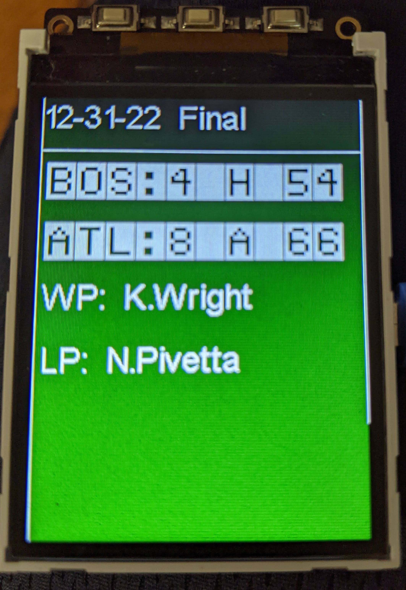| 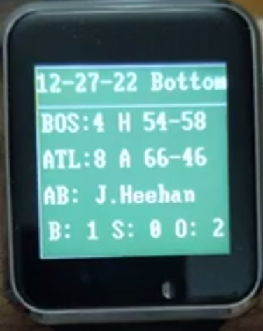| 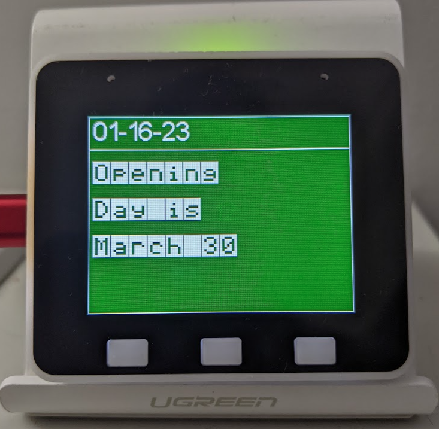| 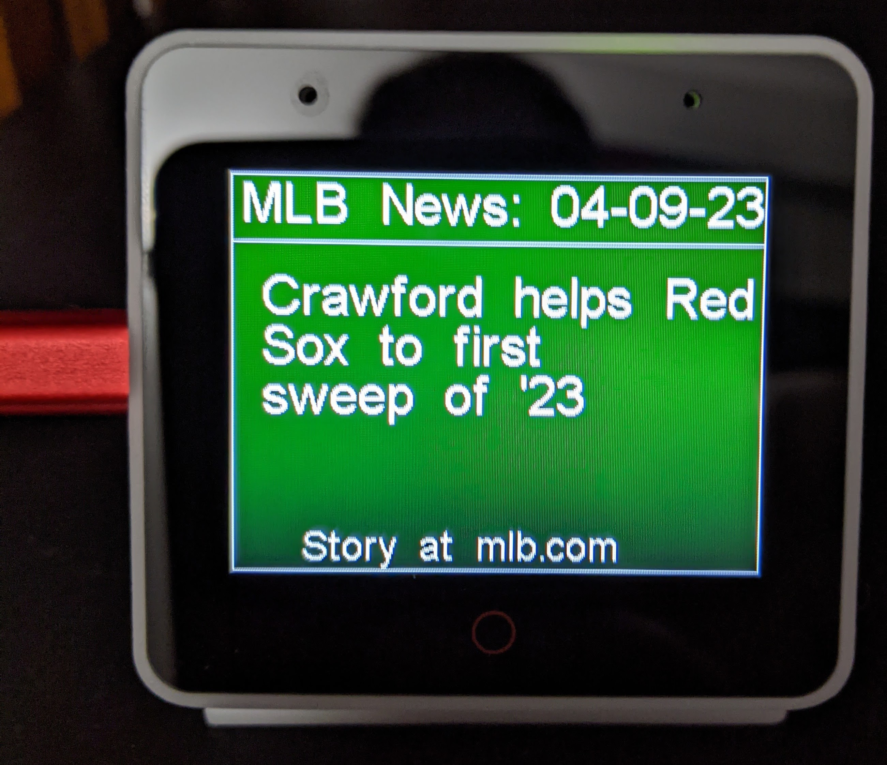|


|<A HREF="https://www.thingiverse.com/thing:3461768"  >ThingVerse #1</A> |<A HREF="https://www.thingiverse.com/thing:3495445/files">ThingVerse #2 </A>|ESP32 on bread board with 2.8" Screen|
| ------------- | ------------- | ------------- | 
|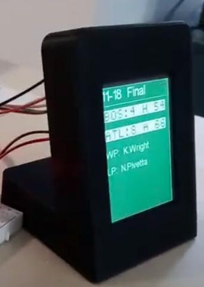| 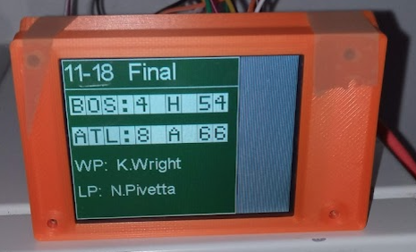| |


- Build your own kiosk for your favorite baseball team:

  LilyGo Watch, LilyGo 2.4 ESP32, ESP32-S3-BOX/BoxLite, or ThingVerse Model using an ESP32 DevKit.  
- If it's gametime for your team, the kiosk will refresh the score every 20 seconds using small http call.
  - then show any 'event' (hit/walk/timeout/homerun/etc) using mlb stats http calls:
   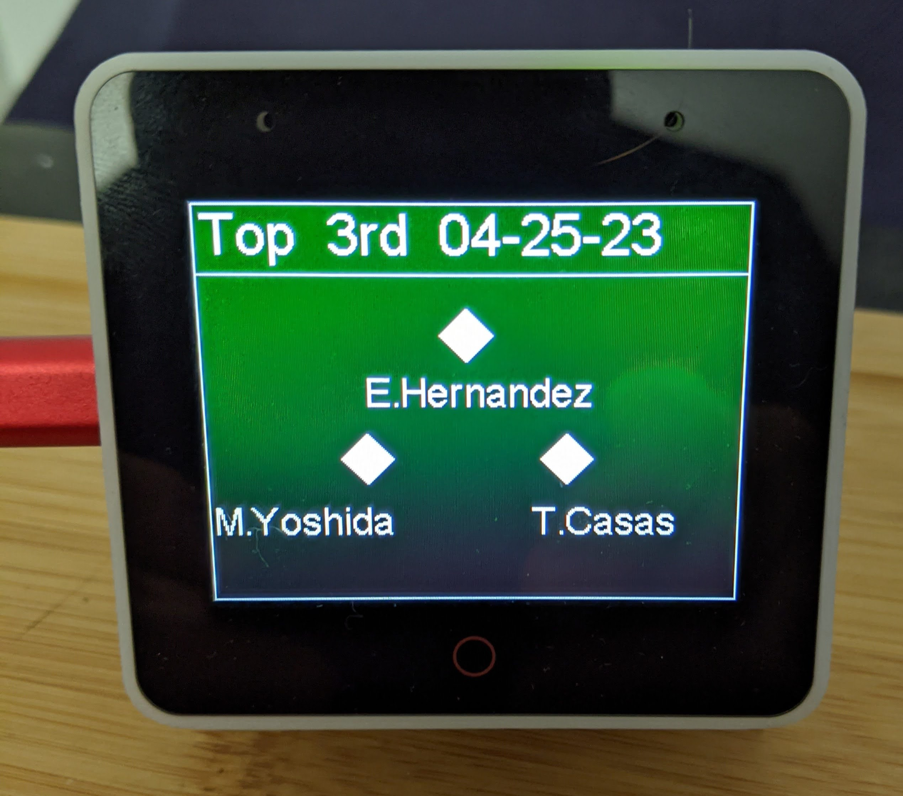
  - then show runners on base if they have changed.
 
- If no game 'today',  it will wait a few hours and retry.
- If it's the offseason, it will tell you when open day is.
- Stories from mlb.com will display afterward for 7 seconds and rotate

#### Requirements (if you are building your own)

- ESP32 DevKitC (or above hardware)
https://www.amazon.com/gp/product/B087TNPQCV/

- Mini USB or USB-C Cable
Anywhere cables are sold (short - 3 ft or less are best)

- 320x240 SPI Serial ILI9341 - https://www.amazon.com/dp/B09XHJ9KRX

- 2.4 GHZ WIFI SSID (esp hardware does not support 5 GHZ) 


#### Steps

- Install MicroPython with <A HREF="https://micropython.org/download/esp32spiram/">SPIRAM</A> to the ESP32:

- (For the LilyGo Watch use <A HREF="https://github.com/russhughes/st7789_mpy/tree/master/firmware/TWATCH-2020">this </A> firmware.)

- Get a REPL on the ESP32:

https://microcontrollerslab.com/getting-started-thonny-micropython-ide-esp32-esp8266/

- Install libraries 
```
git clone https://github.com/jouellnyc/BB-ESP32-KIOSK
 upload appsetup, bbbapp, hardware, fonts, and lib to / using Thonny/your IDE
 upload acknowledgements.py, main.py, boot.py and myugit.py to / using Thonny/IDE.
```

To connect the esp32 to an ili9341, you can follow https://www.youtube.com/watch?v=rq5yPJbX_uk

#### Setup
At boot BB-ESP32-KIOSK launches a temporary wifi SSID named 'bbkiosk32' with a wifi password of '123456789'.

Connect your mobile phone/PC  to that SSID temporarily.

There will be no Internet Access via this ssid:

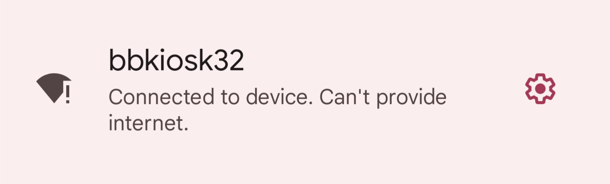
Navigate to http://192.168.4.1

Now, enter the name the Wifi SSID and Credentials you want BB-Kiosk to use permanently:

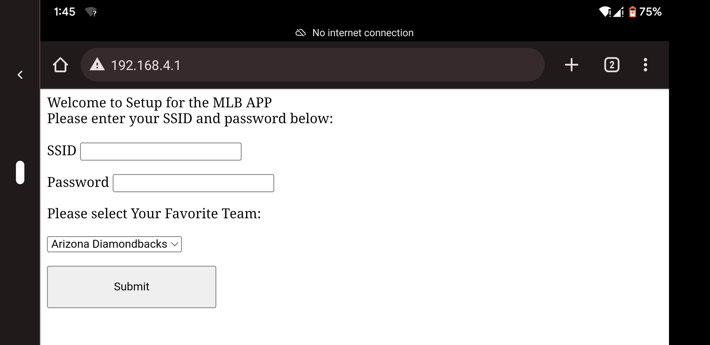

On the same page, select your team from the drop down:

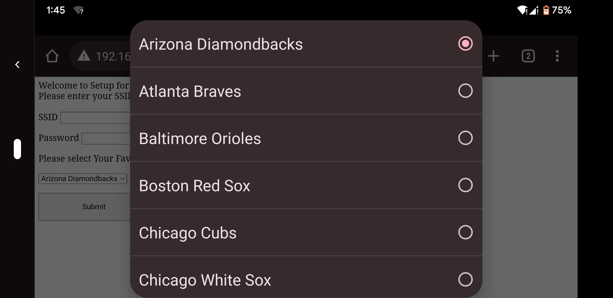

Click Submit (on the same page)

Click Reboot if Successful

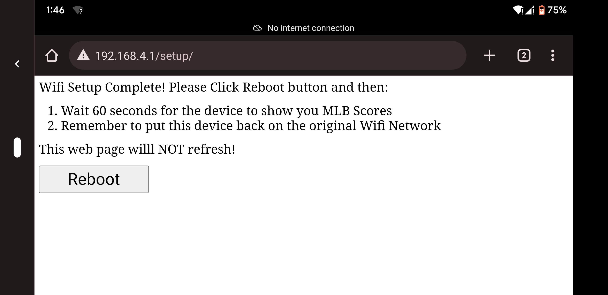

The page will NOT Refesh (This is OK and expected):

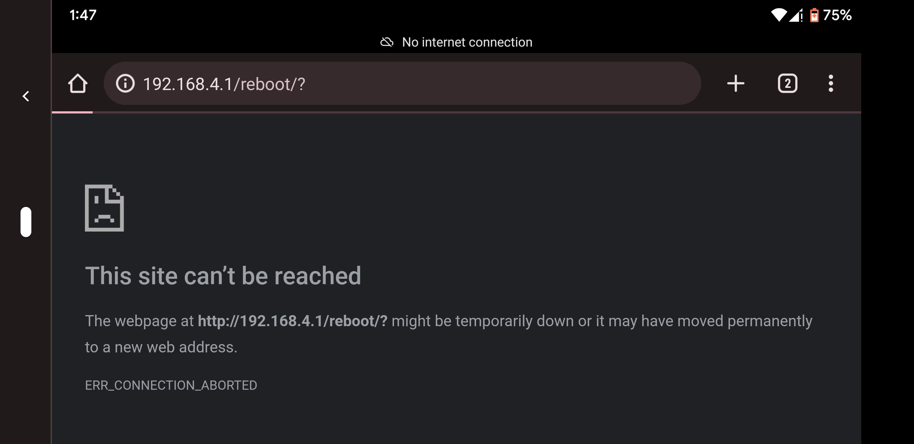

(Connect back to Your Normal Wifi SSID to get your mobile/PC back online.)

The kiosk should boot and show startup mesages:

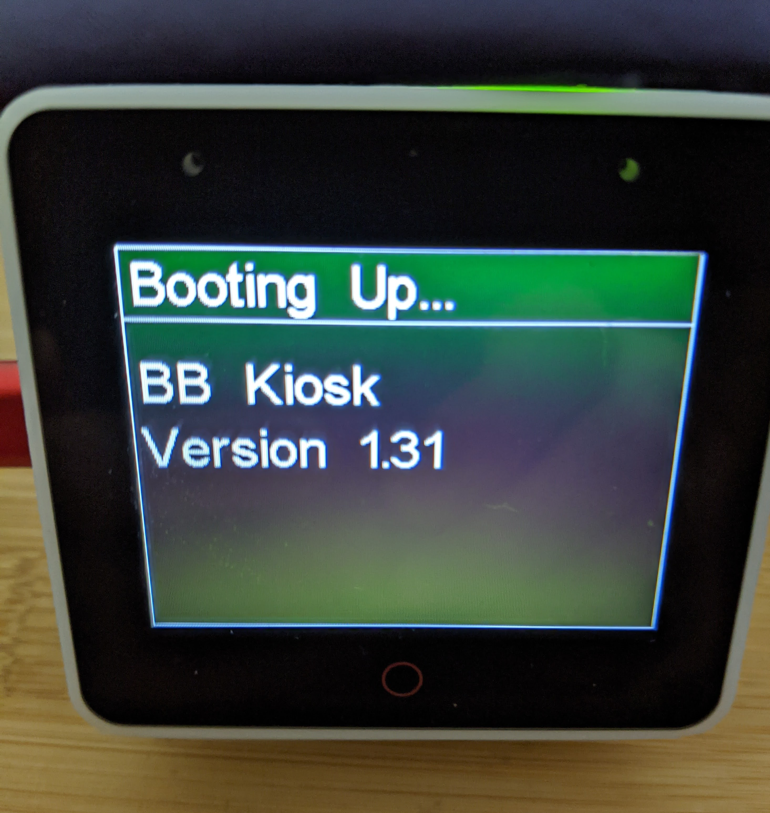

Once Done, it will show you status of Your Team's Game if in progress.

For more details of the flow of information see the <a href="https://github.com/jouellnyc/BB-ESP32-KIOSK/tree/main/images/slideshow">slideshow</A>.

### BreadBoard Version with OLEDs
Looking for the [BreadBoard Version with OLEDs](README.BREAD.BOARD.md) for the old school effect?

Code - https://github.com/jouellnyc/MLB-ESP32/tree/9bc62e9f47f77b68f4ae8cf7bbc0e8fba193373a
