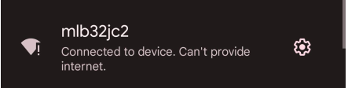

# MLB-ESP32

#### ESP32 MLB Mini Kiosk
ThingVerse Option #1


ThingVerse Option #2


#### What 
- Build your own MLB team kiosk  for your favorite team on a tiny device.
- If it's gametime the kiosk will refresh every 120 seconds.
- If no game it will wait a few hours and retry.

#### Requirements
- ESP32 DevKitC
https://www.amazon.com/gp/product/B087TNPQCV/

- Mini USB Cable
Anywhere Mini usb cables are sold (short - 3 ft or less are best)

- 320x240 SPI Serial ILI9341 - https://www.amazon.com/dp/B09XHJ9KRX

- Configs / Libraries shared in https://github.com/jouellnyc/mcconfigs 

#### Steps
- Install MicroPython with SPIRAM to the ESP32:
- Get a REPL on the ESP32:

https://microcontrollerslab.com/getting-started-thonny-micropython-ide-esp32-esp8266/

- Install libraries 
```
git clone https://github.com/jouellnyc/MLB-ESP32
upload appsetup, mlbapp, main.py and boot.py to / using Thonny/your IDE
git clone https://github.com/jouellnyc/mcconfigs
upload fonts, hardware, and lib to / using Thonny/your IDE
```

If you want to connect the esp32 to an ili9341, you can follow https://www.youtube.com/watch?v=rq5yPJbX_uk

#### Setup
At boot the esp32 launches a wifi SSID named 'mlb32jc2' and a password of '123456789'.

Connect your mobile phone to it:


There will be no Internet Access via this ssid:



Navigate to http://192.168.4.1

Enter your local Wifi SSID, Credentials: (NB: You have one shot to get it right)


On the same page, select your team from the drop down:


Click Submit (on the same page)

Click Reboot if Successful


The page will NOT Refesh (This is OK and expected):


Connect back to Your Normal Wifi SSID

The kiosk should boot and show startup mesages:


Once Done, it will show you status of Your Team.


#### References 
Black Case:
- https://www.thingiverse.com/thing:3495445/files

Orange Case:
- https://www.thingiverse.com/thing:3461768

