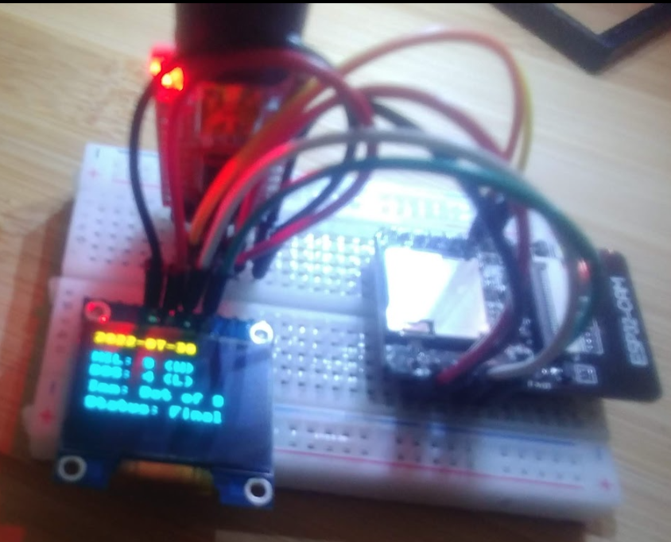

# MLB-ESP32

Build you own MLB team kiosk  for your favorite team on a tiny device - all in for $15 or less...

- ESP32 CAM
https://www.amazon.com/dp/B07WCFGMTF/
You can buy one with or with the ESP32-CAM-MB

- FT232RL FTDI Mini USB to TTL Serial Converter Adapter Module
https://www.amazon.com/HiLetgo-FT232RL-Converter-Adapter-Breakout/dp/B00IJXZQ7C

- Small Bread Board
https://www.amazon.com/Breadboard-Solderless-Prototype-PCB-Board

- Mini USB Cable

- API: https://github.com/toddrob99/MLB-StatsAPI (Modified here)

#### Steps

Using this setup, the FTDI supplies the power and allows for repl, if desired.

- Connect USB FTDI programmer to esp-cam as per the PIN CONNECT link in References.

- Connect Esp-32 CAM (Bare) to OLED with male to male jumpers

  esp32cam OLED
  IO15     sda
  IO13     scl

#### Code Setup

#### Picture of the mini Kiosk

#### References 

PINS: https://stackoverflow.com/questions/71853347/interfacing-oled-to-esp32-cam
PIN CONNECT: https://randomnerdtutorials.com/program-upload-code-esp32-cam/
PIN MAP: https://randomnerdtutorials.com/esp32-cam-ai-thinker-pinout/
OLED SETUP CODE: https://randomnerdtutorials.com/micropython-oled-display-esp32-esp8266/

