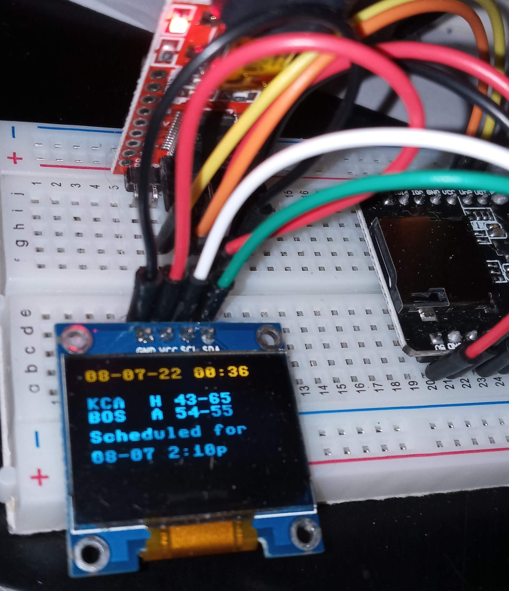

# MLB-ESP32

#### ESP32 CAM MLB Mini Kiosk
||||

#### What 
- Build your own MLB team kiosk  for your favorite team on a tiny device - all in for $15 or less...
- If it's gametime the kiosk will refresh every 120 seconds.
- If no game it will wait a few hours and retry.
- RGB LED (optional) turns RED if your team is losing, GREEN if winning, BLUE if a tie or WHITE if a game is scheduled for later.
- Only 1 Network Request is needed per update to https://statsapi.mlb.com/. 

#### Requirements

- ESP32 CAM
https://www.amazon.com/dp/B07WCFGMTF/

  You can buy one with or with the ESP32-CAM-MB. These boards typically have 4 MB of spiram.

  see https://micropython.org/download/esp32spiram/ for the right firmware.

  This repo is unlikely to work on a ESP8266 based board w/o modifications due to RAM usage, I chose the 4 MB board to
  have plenty. 

  The difference in dollar cost is minimal, but code effort is likely much larger.

- FT232RL FTDI Mini USB to TTL Serial Converter Adapter Module

  https://www.amazon.com/HiLetgo-FT232RL-Converter-Adapter-Breakout/dp/B00IJXZQ7C

- Small Bread Board

  https://www.amazon.com/Breadboard-Solderless-Prototype-PCB-Board

- Mini USB Cable
  Anywhere Mini usb cables are sold
 
- API: https://github.com/toddrob99/MLB-StatsAPI 
  (Modified here - my_mlb_api.py was renamed from __init__.py in MLB-StatsApI and just barely modified.


#### Steps

Using this setup, the FTDI supplies the power and allows for repl, if desired.

- Connect USB FTDI programmer to esp-cam as per the PIN CONNECT link in References.

- Connect Esp-32 CAM (Bare) to OLED with male to male jumpers:

| Esp32cam       | OLED          |
| :-------------:|:-------------:|
| IO15           | sda           |
| IO13           | sdcl          |


- Connect Esp-32 CAM to the RGB LED (optional) :

There are many pics online to  to understand how to setup the reisistor to the RGB:
* https://github.com/danielwohlgemuth/blinking-led-micropython-esp32
* https://learn.sparkfun.com/tutorials/getting-started-with-micropython-and-the-sparkfun-inventors-kit-for-microbit/experiment-4-driving-an-rgb-led
* https://microcontrollerslab.com/esp32-rgb-led-web-server/
* https://microcontrollerslab.com/micropython-pwm-with-esp32-and-esp8266-led-fading-brightness-control-examples/

You can try 200 Ohm resistors, or higher depending on the LED.
I have about 500 Ohms using 2 resistors in series, because that's what I had available at the time.


However, you will be using PINS 12, 2, and 14 for the red, blue, and green legs of the LED respectively. 

This is reflected in rgb.py: 

```
r = Pin(12, Pin.OUT)
g = Pin(2, Pin.OUT)
b = Pin(14, Pin.OUT)
```

You can place the RGB LED in the breadboard in any manner, there is no forward or backwards, but if you count the legs from left to right as 1, 2, 3, 4, I connected
them like this:

| Esp32cam       | RGB LED       |What      |
| :-------------:|:-------------:|:--------:|
| IO14           | 1             | Blue leg |
| IO02           | 2             | Green leg|
| GRND           | 3 longest leg | Ground   |
| IO12           | 4 (furthest to the right)| Red Leg|

Yes, the esp32 cam is very crowded now and is almost using 'all available' GPIOs.


- Install MicroPython with SPIRAM to the ESP32:
- Get a REPL on the ESP32:

https://microcontrollerslab.com/getting-started-thonny-micropython-ide-esp32-esp8266/

- Edit the Wifi Config:
```
vi net_config.py  #should be obvious
```

- Edit tm_id = XXX and set to your team's id 
```
edit the mlb_app_runner.py  file
```

- Upload mlbapp/ folder using Thonny/IDE as well as:
```
- boot.py 
- main.py
```

- Install 2 Libraries
```
import upip
upip.install('urequests')
upip.install('micropython-logging')
```

Note: ssd1306.py is from https://github.com/micropython/micropython/blob/master/drivers/display/ssd1306.py

to '/'

When expanded the view from Thonny should look like this:


#### References 

- PINS: https://stackoverflow.com/questions/71853347/interfacing-oled-to-esp32-cam
- PIN CONNECT: https://randomnerdtutorials.com/program-upload-code-esp32-cam/
- IN MAP: https://randomnerdtutorials.com/esp32-cam-ai-thinker-pinout/
- OLED SETUP CODE: https://randomnerdtutorials.com/micropython-oled-display-esp32-esp8266/

#### TBD
- Using Scrolling for more information on the kiosk
- Implement Push Button for Real Time update
