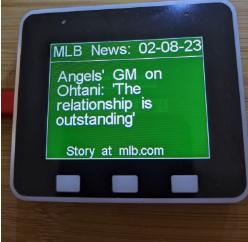

# BB-ESP32-KIOSK

#### ESP32 Game Day BaseBall Kiosk Slide Show

The BB-ESP32-Kiosk will go through several phases:

Booting Up and Launching:

If it is during the regual season, BB-ESP32-Kiosk
will see if there is a game today. If so will show you one of 3 states:

Pregame. Please Wait!

Currently In Progress With Scores, whose at bat, team records and pitch count.

and refresh the score every two minutes.

Final Score
 
and then rotate through 10 news articles at mlb.com.

If there's no game, BB-ESP32-Kiosk will tell you:

and then rotate through 10 news articles at mlb.com.

If it is not during the regual season, BB-ESP32-Kiosk
will tell you when opening day is:

 

And then rotate through 10 news articles at mlb.com. News Examples:

