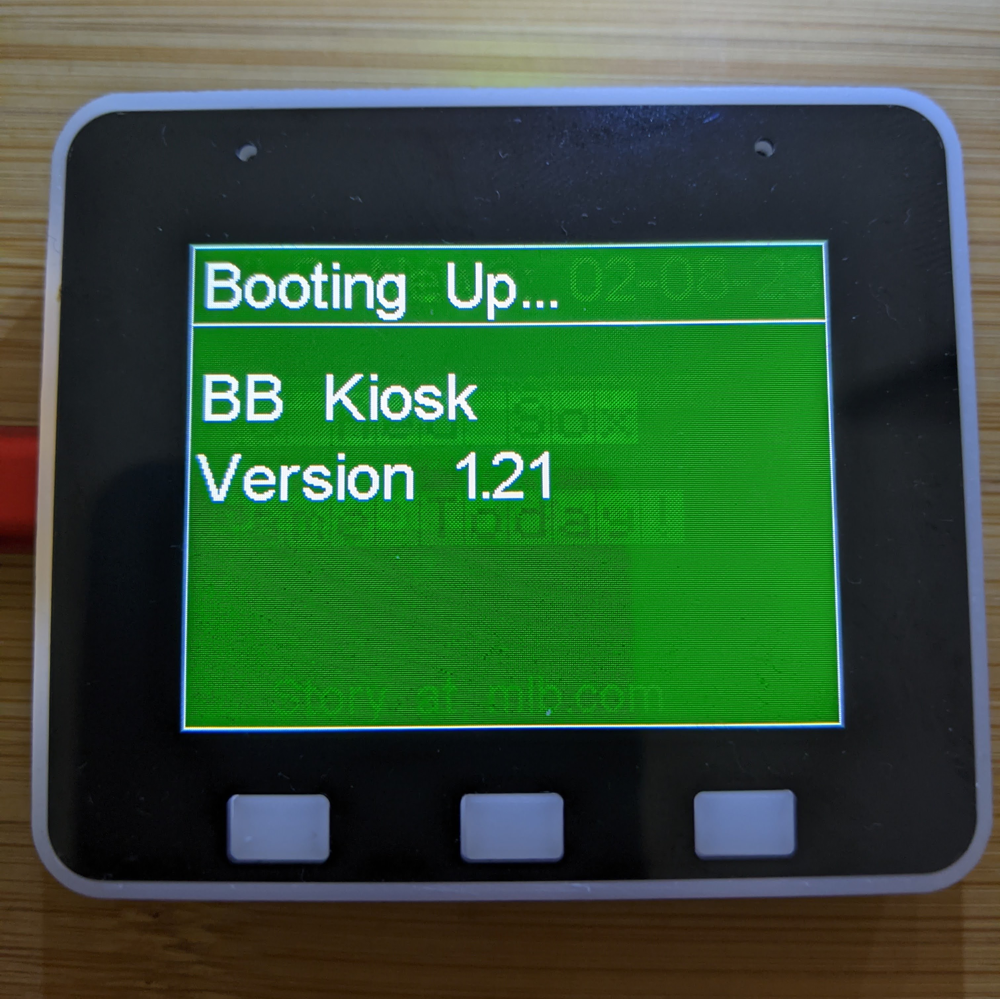
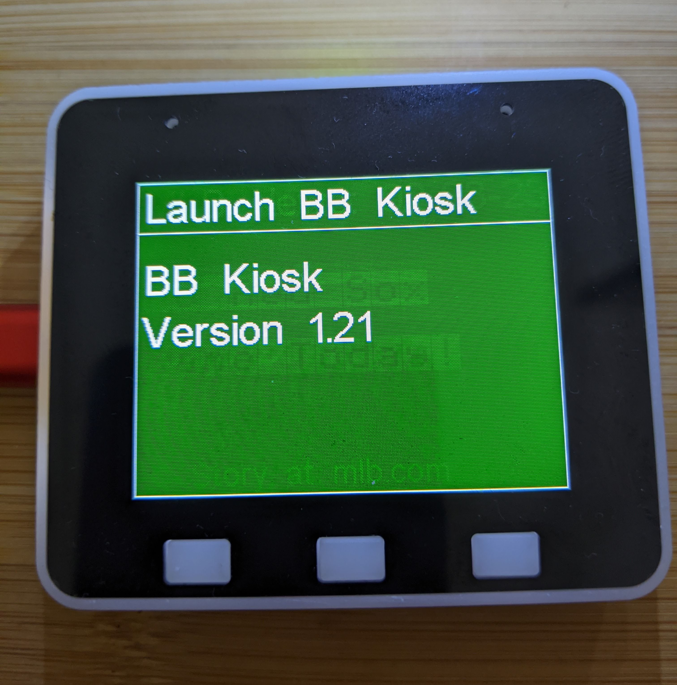
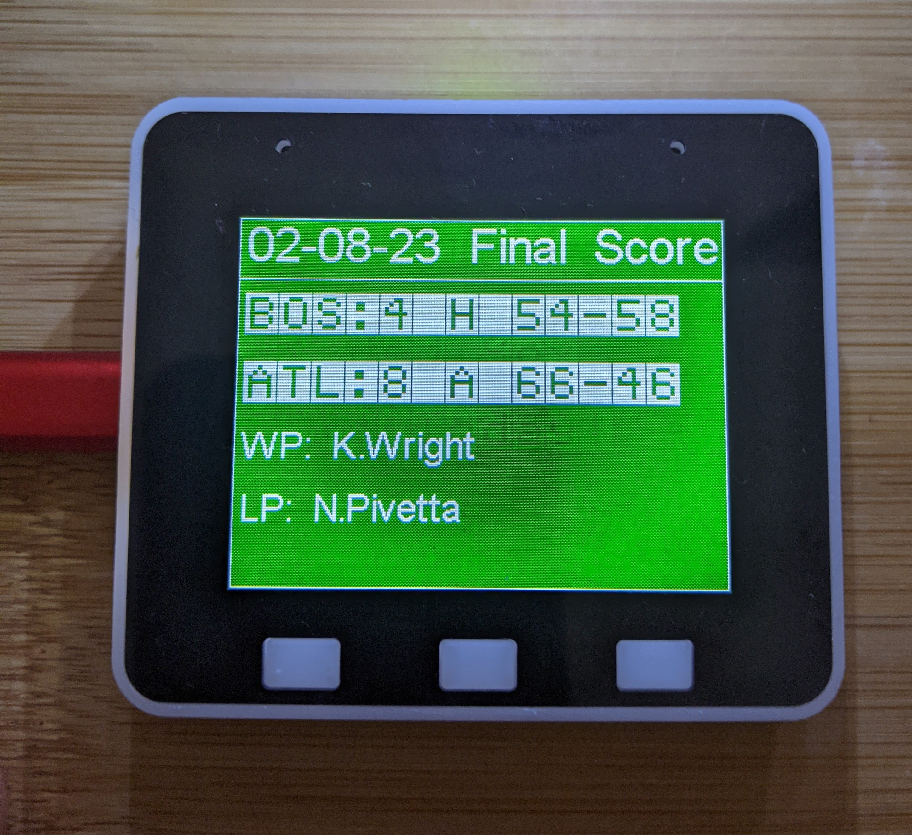
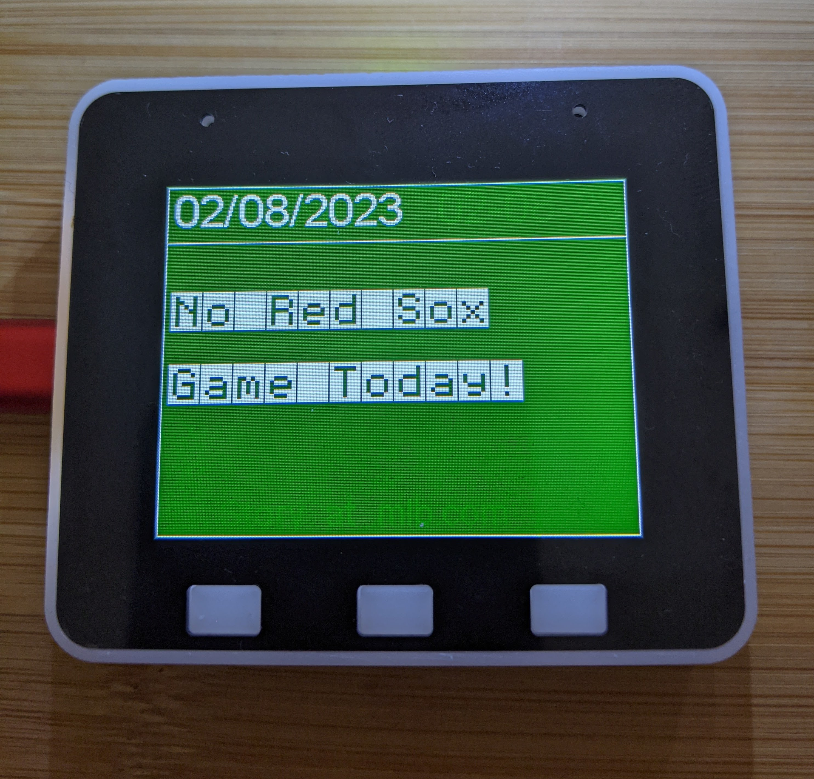
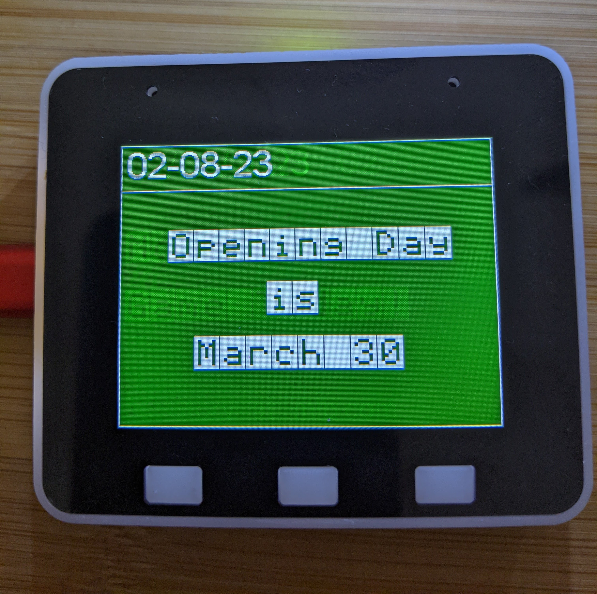
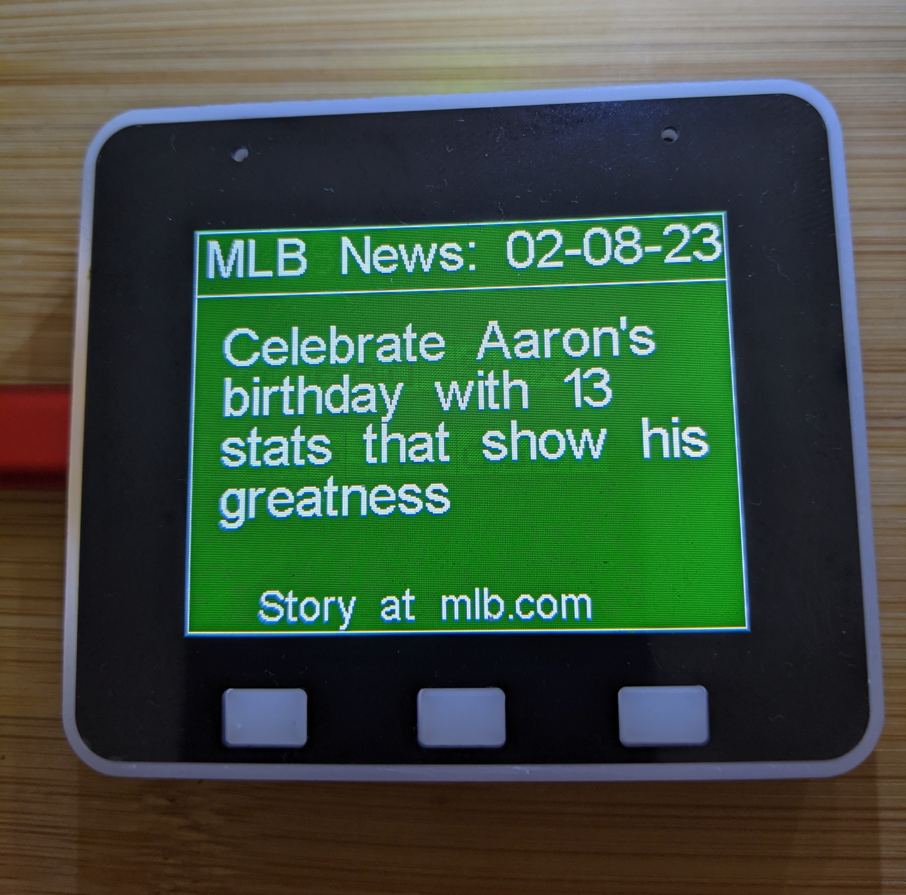
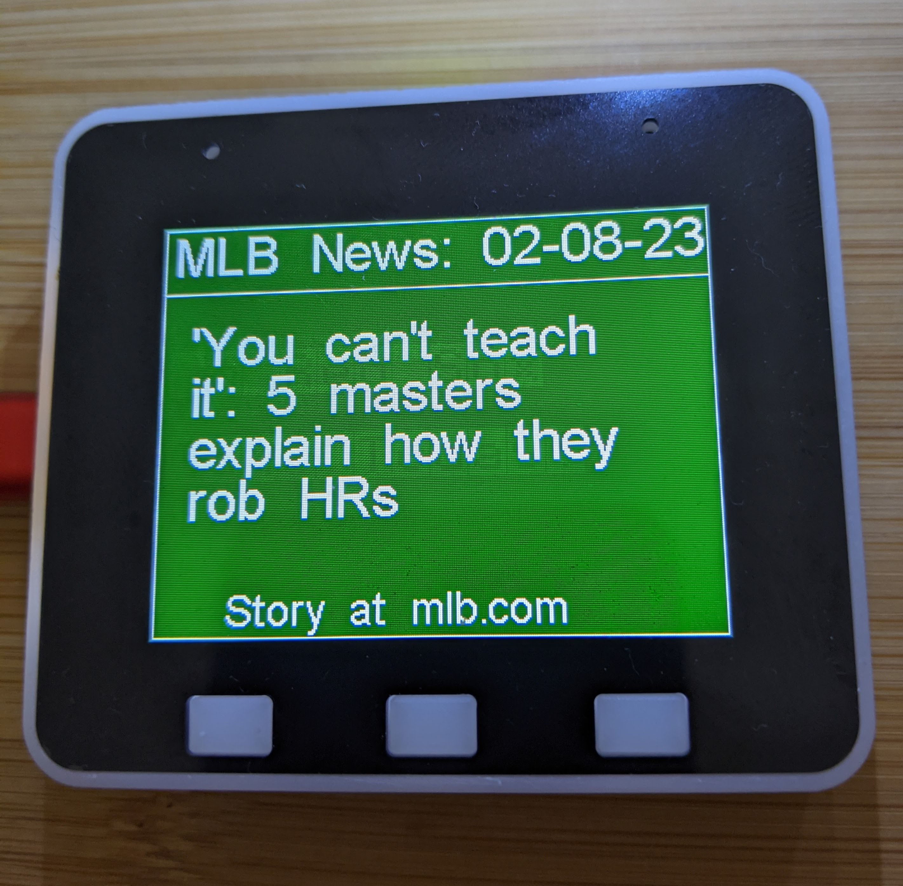

# BB-ESP32-KIOSK

#### ESP32 Game Day BaseBall Kiosk Slide Show

The BB-ESP32-Kiosk will go through several phases:

Booting Up and Launching, and Initialization:

If it is during the regual season, BB-ESP32-Kiosk
will see if there is a game today. If so will show you one of 4 outcomes:

1. Pregame. Games time will be show on the screen. Please Wait!

2. In Progress. (with current score, whose at bat, team records, pitch count, and inning status).

BB-ESP32-KIOSK will refresh the score every 2 minutes.

3. Final Score. 
 

The final score will be shown with winning and losing pitchers, scores and records for 30 seconds. 
BB-ESP32-Kiosk will then  rotate through all the current news articles for the day  at mlb.com and the cycle is repeated.

4. No Game. If there's no game, BB-ESP32-Kiosk will tell you:

BB-ESP32-Kiosk will then  rotate through all the current news articles for the day  at mlb.com and the cycle is repeated.

If it is not during the regual season, BB-ESP32-Kiosk
will tell you when opening day is for 30 seconds:

 

BB-ESP32-Kiosk will then  rotate through all the current news articles for the day  at mlb.com and the cycle is repeated.

For example:

This cycle will repeat infinitely.
